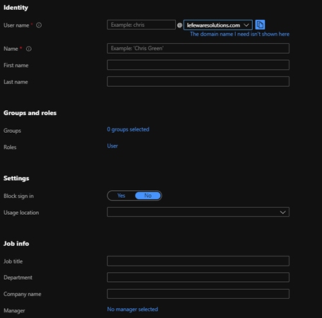
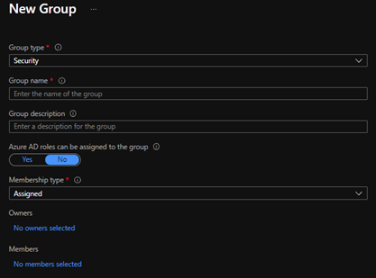
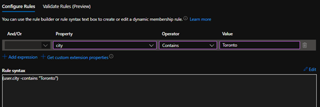
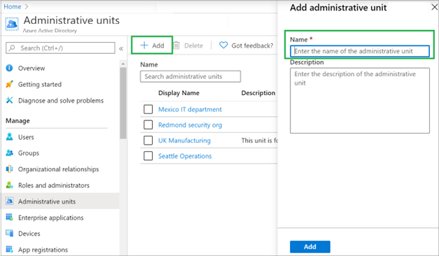
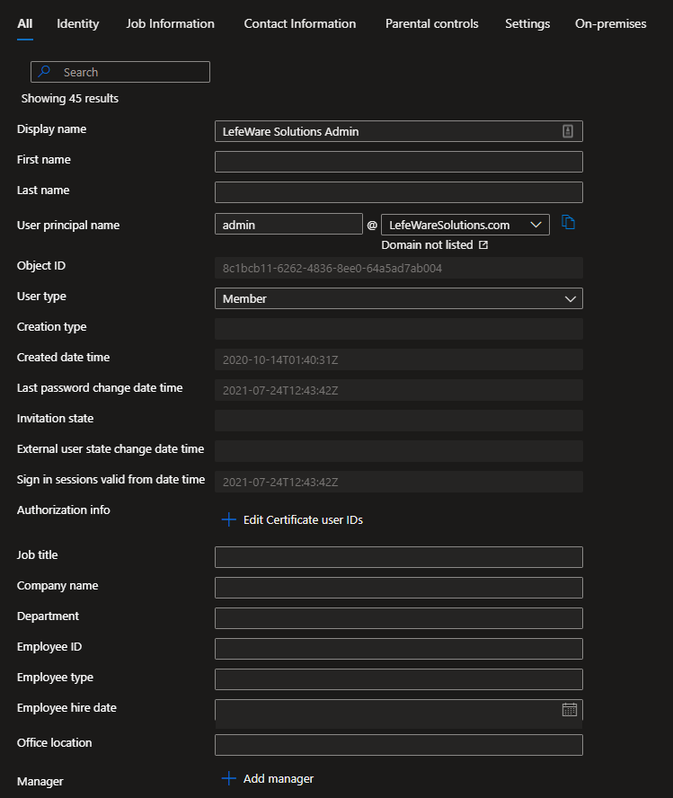
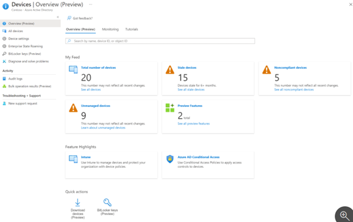
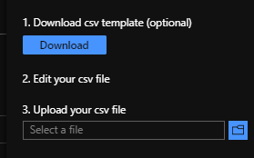
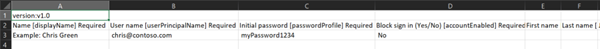
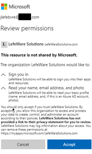

# Manage Azure identities and governance (15–20%)  

## Manage Azure Active Directory (Azure AD) objects  
An object in Azure AD is a programmatic high-level data construct that represents such things as users, groups, and contacts. When you create a new user or contact in Azure AD, you're creating a new instance of that object 

### Create users and groups  
To add or delete users and groups you must be a User administrator or Global administrator. 

**Users:** \
You can create new users and using the Azure Active Directory portal. The following fields are required: 
- **Name:** The first and last name of the new user. For example, Mary Parker. 
- **User name:** The user's name of the new user. For example, mary@contoso.com.The domain part of the user name must use either the initial default domain name, <yourdomainname>.onmicrosoft.com, or a custom domain name, such as contoso.com.  
- **Groups:** Optionally, add the user to one or more existing groups.  
- **Roles**: If you require Azure AD administrative permissions for the user, you can add them to an Azure AD role. 
- **Job info:** Add more information about the user such as title, department etc 

  

Once complete, copy the autogenerated password provided in the Password box to give this password to the user to sign in for the first time. 

**Groups:** \
There are several group types: 
- **Security:** A security group can have users, devices, groups and service principals as its members and users and service principals as its owners. Used to manage member and computer access to shared resources for a group of users. For example, creating a security group for a specific security policy. By doing it this way, you can give a set of permissions to all the members at once, instead of having to add permissions to each member individually.  
- **Microsoft 365:** Gives members access to a shared mailbox, calendar, files, SharePoint site, etc. A Microsoft 365 group can have only users as its members. Both users and service principals can be owners of a Microsoft 365 group 

There are also several membership types: 
- **Assigned:** Allows adding specific users to be members of this group and to have unique permissions. 
- **Dynamic user:** Allows using dynamic membership rules to automatically add and remove members. If a member's attributes change, the system looks at your dynamic group rules for the directory to see if the member meets the rule requirements (is added) or no longer meets the rules requirements (is removed). 
- **Dynamic Device:** Same as dynamic user but for device properties (I.e. deviceOsType Contains X)\

### Create administrative units 
Administrative units allow subdividing an organization into any unit that you want, and then assign specific administrators that can manage only the members of that unit. For example, you could use administrative units to delegate permissions to administrators of each school at a large university, so they could control access, manage users, and set policies only in the School of Engineering

Administrative units are created by using either the Azure portal, PowerShell or Microsoft Graph.

An Azure AD role can then be assigned with a scope that's limited to one or more administrative units and users or groups can be added to an administrative unit to restrict the scope of role permissions 

### Manage user and group properties 
It is possible to add user profile information, including a profile picture, job-specific information, contact info, and some settings using Azure AD through the protal. 
\
Using Azure AD, a group's settings can also be edited, including updating its name, description, or membership type. 

 
### Manage device settings 
Azure Active Directory (Azure AD) provides a central place to manage your organizations device identities and monitor related event information by going to Azure Active Directory > Devices \

 
In the devices overview, the number of total devices, stale devices, noncompliant devices, and unmanaged devices can be managed. There are also links to Intune, Conditional Access, BitLocker keys, and basic monitoring. 

 
### Perform bulk user updates  
Azure AD supports bulk user create and delete operations and supports downloading lists of users as a csv. 

To create users in bulk 
1. As a “User administrator” in the organization. Navigate to Azure AD >  Users > Bulk create. 
2. On the Bulk create user page, select Download to receive a valid comma-separated values (CSV) file of user properties.

3. Open the CSV file and add a line for each user you want to create. The only required values are Name, User principal name, Initial password and Block sign in (Yes/No). Then save the file.\

4. On the Bulk create user page, under Upload your CSV file, browse to the file. When you select the file and click Submit, validation of the CSV file starts. 
5. After the file contents are validated, you’ll see File uploaded successfully. If there are errors, you must fix them before you can submit the job. 
6. When your file passes validation, select Submit to start the Azure bulk operation that imports the new users. 
7. When the import operation completes, you'll see a notification of the bulk operation job status. 
8. You can see the status of all of your pending bulk requests in the Bulk operation results page. 

### Manage guest accounts  
Azure AD business-to-business (B2B) collaboration is a feature within External Identities that allows inviting guest users to collaborate with the current organization. B2B collaboration, allows for securely sharing a company’s applications and services with guest users from any other organization even if they are not using Azure AD. It also allows the guest to use their own credentials. 

To add guest users to an organization in the Azure portal: 
1. Click + New User in Azure AD 
2. Instead of creating a new user, select “Invite user” 
3. Select groups & roles to assign to user just like any other user 
4. User will be sent an invitation for which they will accept and provide a redemption page \

 
User can go to https://myaccount.microsoft.com/organizations to see what apps and orgs they are part of 

### Configure Azure AD join  
Azure AD joined devices are signed in to using an organizational Azure AD account. Access to resources in the organization can be further limited based on that Azure AD account and Conditional Access policies applied to the device identity. 

Azure AD Join provide a means to enforce organization-required configurations like requiring storage to be encrypted, password complexity, software installations, and software updates. Administrators can make organization applications available to Azure AD joined etc. 

Azure AD join can be accomplished using  
- Self-service options like the Out of Box Experience (OOBE),  
- Bulk enrollment 
- Windows Autopilot. 

### Configure self-service password reset (SSPR) 
Enables users to reset their passwords without contacting IT staff for help. If Azure AD locks a user's account or they forget their password, the user can unblock themselves and continue working, thus reducing the non-productive time and high support costs for most common password-related issues. 

Azure AD lets you enable SSPR for None, Selected, or All users: 
1. In Azure Active Directory, then select Password reset from the menu on the left side. 
2. From the Properties page, under the option Self service password reset enabled, select Select group 
3. Browse for and select your Azure AD group, like SSPR-Test-Group, then choose Select. 

With SSPR enabled and set up, test the SSPR process as follows: 
1. Ensure user has authentication methods contact information registered . 
2. Open a new browser window in InPrivate or incognito mode, and browse to https://aka.ms/sspr. 
3. Enter your non-administrator test users' account information, like phone number, the characters from the CAPTCHA, and then select Next. 
4. Follow the verification steps to reset your password. When finished, you'll receive an email notification that your password was reset 

 