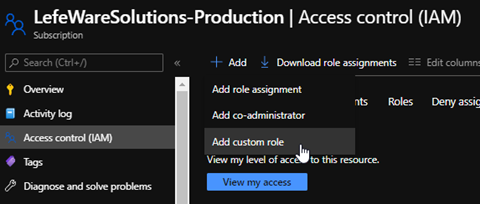
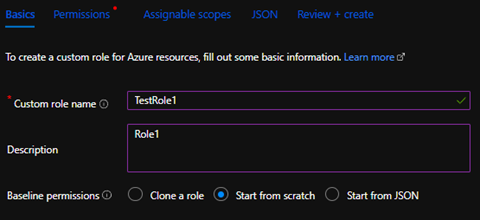
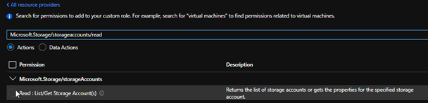
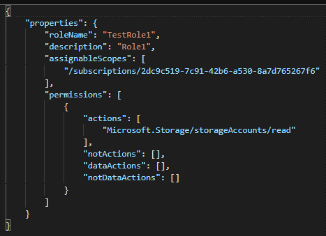
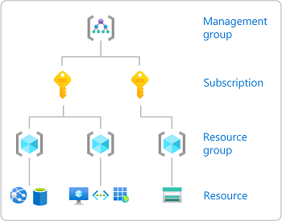
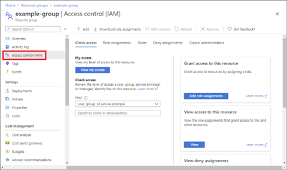
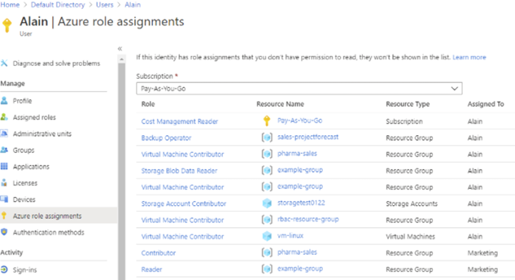

# Manage role-based access control (RBAC) 
Azure role-based access control (Azure RBAC) helps you manage who has access to Azure resources, what they can do with those resources, and what areas they have access to. 

## Create a custom role 
If the Azure built-in roles don't meet the specific needs of your organization, you can create your own custom roles. Just like built-in roles, custom roles can be assigned to users, groups, and service principals at subscription and resource group scopes. Custom roles are stored in an Azure AD directory and can be shared across subscriptions.

Custom roles can be created using the Azure portal, Azure PowerShell, Azure CLI, or the REST API. To create a custom role from portal:
1.	Open a subscription or resource group where the custom role should be assignable and then open “Access control (IAM)”
2.	Select “Add Custom role”\

3.	Give it a Name, Description and for Baseline permissions select one of the following:\
    a.	Clone a role \
    b.	Start from scratch \
    c.	Start from JSON \
 
4.	On the Permissions tab, specify the permissions for the custom role. Depending on whether cloning a role or if starting with JSON, the Permissions tab might already list some permissions.\
  
5.	On the Assignable scopes tab, specify where the custom role is available for assignment, such as management group, subscriptions, or resource groups. This tab might already list the scope where the tab was opened the Access control (IAM) page.
6.	On the JSON tab, the custom role is formatted in JSON. The JSON can be directly edited here (I.e. add a wildcard (\*) permission – Microsoft.Storage/storageAccounts/*).\
   
7.	Review and create

View the custom role in the Roles list

## Provide access to Azure resources by assigning roles at different scopes
When assigning roles, a scope must be specified. Scope is the set of resources the access applies to. In Azure, a scope can be applied at four levels from broad to narrow: management group, subscription, resource group, and resource.

  

Access control (IAM) is the page that is typically used to assign roles to grant access to Azure resources. It's also known as identity and access management (IAM) and appears in several locations in the Azure portal. The following shows an example of the Access control (IAM) page for a resource group:
   

Interpret access assignments 
A quick way to see the roles assigned to a user or group in a subscription is to use the Azure role assignments pane.
1.	In the portal select Azure AD and then select Users or Groups.
2.	Click the user or group to list the role assignments for.
3.	Click “Azure role assignments”.
4.	A list of roles assigned to the selected user or group at various scopes such as management group, subscription, resource group, or resource will be listed. 
    
