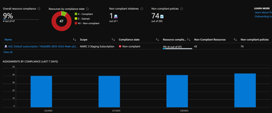
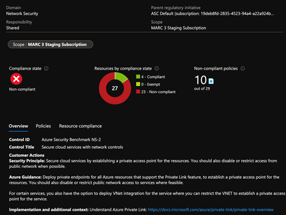

# Manage subscriptions and governance 
Governance provides mechanisms and processes to maintain control over applications and resources in Azure. It involves planning initiatives and setting strategic priorities. 

## Configure Azure policies 
Azure Policy helps to enforce organizational standards and to assess compliance at-scale. The compliance dashboard in Azure provides an aggregated view to evaluate the overall state of the environment, with the ability to drill down to the per-resource, per-policy granularity. It also helps to bring resources to compliance through bulk remediation for existing resources and automatic remediation for new resources.

To simplify management, several business rules can be grouped together to form a policy initiative (sometimes called a policySet)

    

Azure Policy evaluates resources in Azure by comparing the properties of those resources to business rules. These business rules, described in JSON format, are known as policy definitions.

  

Creating and implementing a policy in Azure Policy begins with creating a policy definition. Every policy definition has conditions under which it's enforced and has a defined effect that takes place if the conditions are met. There are several built-in policies that are available by default. For example:
-	Allowed Storage Account SKUs (Deny)
-	Allowed Locations (Deny)
-	Allowed Virtual Machine SKUs 
-	Add a tag to resources (Modify): Applies a required tag and its default value if it's not specified by the deploy request.
-	Not allowed resource types (Deny)

To assign a custom policy follow these steps:
1.	From the Policy page, select Assignments on the left side of the Azure Policy page. 
2.	Select Assign Policy from the top of the Policy - Assignments page.
3.	On the Assign Policy page:
    - Set the Scope (I.e., subscription or resourcegroup). A scope determines what resources or grouping of resources the policy assignment gets enforced on. Then use the Select button at the bottom of the Scope page.
    - Select resource exclusions
	 - Select the Policy definition ellipsis to open the list of available definitions. Azure Policy comes with built-in policy definitions you can use. Enforce tag and its value
	 - The Assignment name is automatically populated with the policy name you selected, but you can change it. 
	  - Enable or disable this policy
 
4.	Leave Create a Managed Identity unchecked. This box must be checked when the policy or initiative includes a policy with either the deployIfNotExists or modify effect.
5.	Set the Non-compliance message
6.	Review and Create

The assignment policy can then be viewed from Policy dashboard to begin identifying non-compliant resources to understand the compliance state of your environment.

## Configure resource locks 
An Azure administrator can lock a subscription, resource group, or resource to prevent other users in an organization from accidentally deleting or modifying critical resources. The lock overrides any permissions the user might have. You can set the lock level to CanNotDelete or ReadOnly
To configure a lock:
1.	In the Settings blade for the resource, resource group, or subscription that you wish to lock, select Locks.
  
2.	To add a lock, select Add. If you want to create a lock at a parent level (e.g. resource group where the resource resides), select the parent.
3.	Give the lock a name and lock level. Optionally, you can add notes that describe the lock.

## Apply and manage tags on resources 
Tags can be applied to Azure resources, resource groups, and subscriptions to logically organize them into a taxonomy. Each tag consists of a name and a value pair. For example,  applying the name Environment and the value Production to all the resources in production.

The Contributor role or Microsoft.Resources/tags permission grants the required access to apply tags to any entity. The following PowerShell script can be used to apply tags
 

## Manage resource groups 
A resource group is a container that holds related resources for an Azure solution. The resource group can include all the resources for the solution, or only those resources that should be managed as a group.  Generally, add resources that share the same lifecycle to the same resource group so you can easily deploy, update, and delete them as a group.
 

## Manage subscriptions 
Organizations often use multiple Azure subscriptions to avoid per-subscription resource limits and to better manage and govern their Azure resources. 

## Manage costs 
Cost Management + Billing is a suite of tools provided by Microsoft that help you analyze, manage, and optimize the costs of workloads. The Cost Management + Billing features can be used to:
•	Conduct billing administrative tasks such as paying bills
•	Manage billing access to costs
•	Download cost and usage data that was used to generate monthly invoices
•	Proactively apply data analysis to costs
•	Set spending thresholds
•	Identify opportunities for workload changes that can optimize spending
Cost Management shows organizational cost and usage patterns with advanced analytics:
 
## Configure management groups 
If an organization has multiple subscriptions, then a management group hierarchy can be used to help manage subscriptions and resources. Azure management groups help efficiently manage:
 -	Access
-	Policies
-	Compliance

If applying access or policy at one level in the hierarchy, it propagates down to the lower levels.
 
To create a management group in the portal:
1.	Select Management groups in Azure.
2.	Select + Add management group.
3.	Select Create New and give the management an id and name.
4.	Once created, subscriptions can be moved between groups and access and policies can be set at the management group level by selecting
 

