# Configure and manage virtual networking (25–30%)  

## Implement and manage virtual networking  
An Azure Virtual Network (VNet) is the fundamental building block of any private network in Azure. VNet enables many types of Azure resources, such as Azure VMs, to securely communicate with each other, the internet, and on-premises networks.A VNet is similar to a traditional network that would be operated in any data center, but brings with it additional benefits of Azure's infrastructure such as scale, availability, and isolation.

### Create and configure virtual networks, including peering  
VNet peering enables seamlessly connecting two or more VNets in Azure, appearing as one for connectivity purposes. The traffic between virtual machines in peered VNets uses the Microsoft backbone infrastructure. Like traffic between virtual machines in the same network, traffic is routed through Microsoft's private network only, meaning no public Internet, gateways, or encryption is required.

Azure supports the following types of peering:

- Virtual network peering: Connecting virtual networks within the same Azure region.
- Global virtual network peering: Connecting virtual networks across Azure regions.

Other key points for peering:
- Resources in either virtual network can directly connect with resources in the peered virtual network. 
- The network latency between virtual machines in peered virtual networks in the same region is the same as the latency within a single virtual network. 
- Apply network security groups in either virtual network to block access to other virtual networks or subnets

See ./Networking/Peering for examples

### Configure private and public IP addresses  
Private IP addresses allow communicate between resources in an Azure virtual network and connected networks. A private IP address also enables outbound communication to the Internet using an unpredictable IP address. Services that use a private IP addresses in Azure are as follows:
- Virtual Machine Network Interface
- Internal Load Balncers
- Application Gateway

A Public IP address assigned to an Azure resource enables inbound communication to a virtual machine from the Internet and enables outbound communication from the virtual machine to the Internet using a predictable IP address. Some of the resources you can associate a public IP address resource with:
- Virtual machine network interfaces
- Virtual machine scale sets
- Public Load Balancers
- Virtual Network Gateways (VPN/ER)
- NAT gateways
- Application Gateways
- Azure Firewall
- Bastion Host
- Route Server

### Configure user-defined network routes  
Azure routes outbound traffic from a subnet based on the routes in a subnet's route table. 

Below are the two types of routing:

**System Routes:**
Azure automatically creates a route table for each subnet within an Azure virtual network and adds system default routes to the table.

Each route contains an address prefix and next hop type. When traffic leaving a subnet is sent to an IP address within the address prefix (CIDR Range) of a route, the route that contains the prefix is the route Azure uses

 

 **User Defined Routes:**
These Azure's system routes can be overriden with custom routes, and add more custom routes to route tables. To create a route table in azure, it must be associated to a virtual network subnet, thus combinining it with the system routes. It is possible to specify the following next hop types when creating a user-defined route:
- Virtual appliance: A virtual appliance is a virtual machine that typically runs a network application, such as a firewall. When creating a route with the virtual appliance hop type, a next hop IP address must also be specified.
- Virtual network gateway: For traffic destined for specific address prefixes routed to a virtual network gateway. The virtual network gateway must be created with type VPN
- None: Used when wanting to drop traffic to an address prefix, rather than forwarding the traffic to a destination
- Virtual network: Specify when overriding the default routing within a virtual network
- Internet: Specify when wanting to explicitly route traffic destined to an address prefix to the Internet, or for traffic destined for Azure services with public IP addresses kept within the Azure backbone network.
- Service Tag: Specify a service tag as the address prefix for a user-defined route instead of an explicit IP range

**How Azure Determines Routing:**
When outbound traffic is sent from a subnet, Azure selects a route based on the destination IP address, using the longest prefix match algorithm.One route specifies the 10.0.0.0/24 address prefix, while the other route specifies the 10.0.0.0/16 address prefix. Azure routes traffic destined for 10.0.0.5, to the next hop type specified in the route with the 10.0.0.0/24 address prefix, because 10.0.0.0/24 is a longer prefix than 10.0.0.0/16, even though 10.0.0.5 is within both address prefixes. 

**Creating a User Defined Route in Azure:**
See ConfigureAndManageVirtualNetworking/Networking/UserDefinedRoute/UserDefinedRouteTable.ps1
 

### Implement subnets  
All Azure resources deployed into a virtual network are deployed into a subnet within a virtual network.

### Configure Service endpoints on subnets  
Service endpoints allow secure and direct connectivity to specific Azure resources over an optimized route over the Azure backbone network, thus traffic never traverses over the public internet. In other words it allow private IP addresses in a specific subnet to reach the endpoint of an Azure service without needing a public IP address on the VNet

When allowing a subnet to access service endpoints for a service, the subnet must enable those specifc type(s) of services in order to allow egress traffic.

 

On the other end, for the service that has incoming traffic, we must enable only selected networks and add a "Virtual Network Rule" for the VNet which should be allowing traffic from. In other words we are **restricting** traffic from that VNet.

 

For example, on Subnet A, we allow the "Microsoft.Storage" Service Endpoints, allowing the private resources inside the subnet to communicate with storage accounts that reside outside of the private network. For the storage account, we create a network rule, saying only allow traffic from that specific network.

 

Service Endpoints are available for the following services along with the name of the service type to be enabled
- Azure Storage (Microsoft.Storage)
- Azure SQL Database, Azure Synapse Analytics, Azure Database for PostgreSQL, Azure Database for MySQL server, Azure Database for MariaDB(Microsoft.Sql)
- Azure Cosmos DB (Microsoft.AzureCosmosDB)
- Azure Key Vault (Microsoft.KeyVault)
- Azure Service Bus (Microsoft.ServiceBus)
- Azure Event Hubs (Microsoft.EventHub)
- Azure Data Lake Store Gen 1 (Microsoft.AzureActiveDirectory)
- Azure App Service (Microsoft.Web)
- Azure Cognitive Services (Microsoft.CognitiveServices)

### Configure private endpoints  
A private endpoint is a network interface that uses a private IP address from the actual virtual network. This network interface connects privately and securely to a service that's connected by 'Azure Private Link'. By enabling a private endpoint, it is essentially bringing the service into the virtual network.Traffic between the virtual network and the service travels the Microsoft backbone network with exposing the service to the public internet. 

 

Private endpoints provide a privately accessible IP address for the Azure service, but do not necessarily restrict public network access to it. Azure App Service and Azure Functions become inaccessible publicly when they are associated with a private endpoint. **All other Azure services require additional access controls**. 

 

 To connect to an Azure service over private endpoint, separate DNS settings, often configured via private DNS zones, are required. The settings must resolve to the private IP address of the private endpoint. The network interface associated with the private endpoint contains the information that's required to configure your DNS including the private IP address for a private-link resource.

**DNS Group:**
If integrating a private endpoint with a private DNS zone, a private DNS zone group is also created. The DNS zone group is a strong association between the private DNS zone and the private endpoint that helps auto-updating the private DNS zone when there is an update on the private endpoint

### Configure Azure DNS, including custom DNS settings and private or public DNS zones  
The Domain Name System, or DNS, is responsible for translating (or resolving) a service name to an IP address. Azure DNS is a hosting service for domains and provides naming resolution using the Microsoft Azure infrastructure.

**Public DNS:**
Azure DNS provides a globally distributed and high-availability name server infrastructure that you can be used to host, but not purchase a domain. By hosting domains in Azure DNS,  DNS records can be managed with the same credentials, APIs, tools, billing, and support as your other Azure services

**Private DNS:**
Azure Private DNS provides a reliable and secure DNS service for virtual networks. Azure Private DNS manages and resolves domain names in the virtual network without the need to configure a custom DNS solution. By using private DNS zones, custom domain names can be used instead of the Azure-provided names during deployment. Using a custom domain name you tailor your virtual network architecture to best suit your organization's needs and provides easy to remember naming resolution for resources within a virtual network and connected virtual networks. 

**DNS Zones:**
A DNS zone is used to host the DNS records for a particular domain. To host a domain in Azure DNS, a DNS zone for that domain name must be created where each DNS record for that domain is then created inside this DNS zone. For example, the domain 'contoso.com' may contain several DNS records, such as 'mail.contoso.com' (for a mail server) and 'www.contoso.com' (for a web site).
 

- When creating a DNS zone in Azure DNS, the name of the zone must be unique within the resource group, and the zone must not exist already. Otherwise, the operation fails. The same zone name can be reused in a different resource group or a different Azure subscription. 
- To resolve the records of a private DNS zone from your virtual network, the vnet must be linked with the zone. Linked virtual networks have full access and can resolve all DNS records published in the private zone. 
- Enabling autoregistration on a virtual network link allows for  DNS records for VMs in that network to auto register in the private zone
 
 ---
## Secure access to virtual networks  

### Create security rules  
Azure network security groups (NSGs) can filter network traffic between Azure resources in an Azure virtual network. An NSG contains security rules that allow or deny inbound network traffic to, or outbound network traffic from, several types of Azure resources. Each rule allows specifying source and destination, port, and protocol.

- Name:	A unique name within the network security group.
- Priority:	A number between 100 and 4096. Rules are processed in priority order, with lower numbers processed before higher numbers, because lower numbers have higher priority. Once traffic matches a rule, processing stops. 
- Source or destination:	Any, or an individual IP address, CIDR block (eg. 10.0.0.0/24), service tag, or application security group.
- Protocol	TCP, UDP, ICMP, ESP, AH, or Any.
- Direction:	Whether the rule applies to inbound, or outbound traffic.
- Port range:	Specify an individual or range of ports (eg. 80 or 10000-10005). 
- Action:	Allow or deny

 

### Associate a network security group (NSG) to a subnet or network interface  
It is possible to associate zero, or one, network security group to each **VNet subnet** and **network interface**in a virtual machine. The same network security group can be associated to as many subnets and network interfaces as you choose.

The following picture illustrates different scenarios for how network security groups might be deployed to allow network traffic to and from the internet over TCP port 80:

 

Inbound Rules:
- VM1: The security rules in NSG1 are processed first, since it's associated to Subnet1 and VM1 is in Subnet1. Unless a rule has been created that allows port 80 inbound, the traffic is denied by the default DenyAllInbound default security rule, and never evaluated by NSG2, since NSG2 is associated to the network interface. If NSG1 has a security rule that allows port 80, the traffic is then processed by NSG2 associated to NIC1. To allow port 80 to the virtual machine, both NSG1 and NSG2 must have a rule that allows port 80 from the internet.

- VM2: The rules in NSG1 are processed because VM2 is also in Subnet1. Since VM2 doesn't have a network security group associated to its network interface, it receives all traffic allowed through NSG1 or is denied all traffic denied by NSG1. 

Outbound Rules:
- VM1: The security rules in NSG2 are processed first. Unless a security rule that denies port 80 outbound to the internet was created, the traffic is allowed by the AllowInternetOutbound default security rule in both NSG1 and NSG2. If NSG2 has a security rule that denies port 80, the traffic is denied, and never evaluated by NSG1. To deny port 80 from the virtual machine, either, or both of the network security groups must have a rule that denies port 80 to the internet.

- VM2: All traffic is sent through the network interface to the subnet, since the network interface attached to VM2 doesn't have a network security group associated to it. The rules in NSG1 are processed.

Intra-Subnet Traffic
-  If a rule is added to *NSG1 that denies all inbound and outbound traffic, VM1 and VM2 will no longer be able to communicate with each other.

### Implement Azure Firewall 
Microsoft’s Azure Firewall is a cloud-native security solution for Azure environments. It provides traffic inspection, filtering, and monitoring. Azure Firewall denies all traffic by default, until rules are manually configured to allow traffic.

Unlike an NSG, which is more targeted and is deployed to particular subnets and/or network interfaces, an Azure Firewall monitors traffic more broadly. Applying rules based on IP addresses, port numbers, networks, and subnets is possible with both firewall and NSG. Additionally, NSGs do not offer a threat-intelligence-based filtering option, but Azure Firewall does.

 

Ountbound Firewall Policies:
- Application rules:  Define fully qualified domain names (FQDNs) that can be outbound accessed from a subnet.
 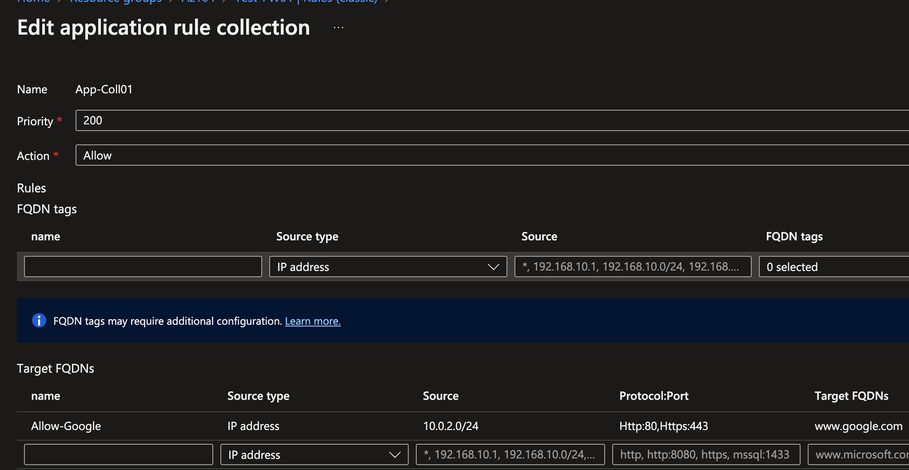

- Network rules: that define source address, protocol, destination port, and destination address.
 
Network traffic is subjected to the configured firewall rules when network traffic is routed to the firewall as the subnet's default gateway.

All outbound virtual network traffic IP addresses are translated to the Azure Firewall public IP (Source Network Address Translation). 

Inbound Firewall Policies:
- Inbound DNAT: Inbound Internet network traffic to your firewall public IP address is translated (Destination Network Address Translation) and filtered to the private IP addresses on your virtual networks.
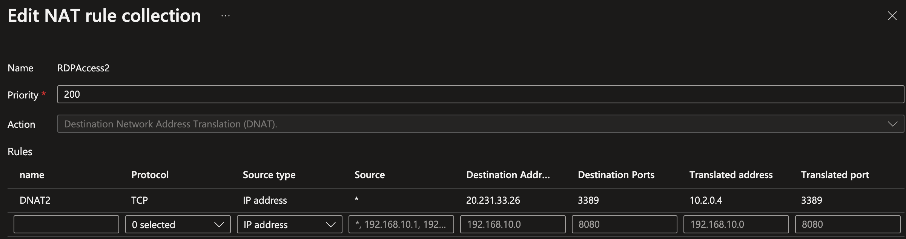

### Implement Azure Bastion  
Azure Bastion is a service that allows connecting to a virtual machine using a browser and the Azure portal, or via the native SSH or RDP client already installed on a local computer. The Azure Bastion service is a fully platform-managed PaaS service that is provisioned inside a virtual network. It provides secure and seamless RDP/SSH connectivity to VMs directly from the Azure portal over TLS. When connecting via Azure Bastion, the virtual machines don't need a public IP address, agent, or special client software.

There is no need to apply any NSGs to the Azure Bastion subnet because Azure Bastion connects to a virtual machines over private IP. Therefore instead, configure NSGs to allow RDP/SSH from Azure Bastion only.

## Configure load balancing  

### Configure Azure Application Gateway 
Azure Application Gateway is a web traffic load balancer that enables to managing traffic to web applications. Traditional load balancers operate at the transport layer (OSI layer 4 - TCP and UDP) and route traffic based on source IP address and port, to a destination IP address and port.

Application Gateway can make routing decisions based on additional attributes of an HTTP request, for example URI path or host headers. For example, you can route traffic based on the incoming URL. So if /images is in the incoming URL, you can route traffic to a specific set of servers (known as a pool) configured for images. If /video is in the URL, that traffic is routed to another pool that's optimized for videos.

The AppGW v2 SKU includes the following freature:
- Autoscaling: Application Gateway or WAF deployments under the autoscaling SKU can scale out or in based on changing traffic load patterns.
- Zone redundancy: An Application Gateway or WAF deployment can span multiple Availability Zones, removing the need to provision separate Application Gateway instances in each zone with a Traffic Manager. 
- Static VIP: Application Gateway v2 SKU supports the static VIP type exclusively. This ensures that the VIP associated with the application gateway doesn't change for the lifecycle of the deployment, even after a restart. 
- Header Rewrite: Application Gateway allows you to add, remove, or update HTTP request and response headers with v2 SKU. 
- Key Vault Integration: Application Gateway v2 supports integration with Key Vault for server certificates that are attached to HTTPS enabled listeners.
- Mutual Authentication (mTLS): Application Gateway v2 supports authentication of client requests. 
- Azure Kubernetes Service Ingress Controller: The Application Gateway v2 Ingress Controller allows the Azure Application Gateway to be used as the ingress for an AKS cluster
- Private link: offers private connectivity from other virtual networks in other regions and subscriptions through the use of private endpoints.
- Performance enhancements: Offers up to 5X better TLS offload performance as compared to the Standard/WAF SKU.
-Faster deployment and update time The v2 SKU provides faster deployment and update time as compared to Standard/WAF SKU. 

### Configure an internal or public load balancer  
Azure Load Balancer operates at layer 4 of the Open Systems Interconnection (OSI) model by distributing inbound flows that arrive at the load balancer's front end to backend pool instances. 

- Azure Load Balancer rules require a health probe to detect the endpoint status. The configuration of the health probe and probe responses determines which backend pool instances will receive new connections. Use health probes to detect the failure of an application.
- The backend pool instances can be Azure Virtual Machines or instances in a virtual machine scale set.

A public load balancer provides outbound connections to virtual machines (VMs) inside a virtual network. These connections are accomplished by translating their private IP addresses to public IP addresses. Public Load Balancers are used to load balance internet traffic to VMs.

An internal (or private) load balancer is used where private IPs are needed at the frontend only. Internal load balancers are used to load balance traffic inside a virtual network. A load balancer frontend can be accessed from an on-premises network in a hybrid scenario.

### troubleshoot load balancing  
When the Load Balancer connectivity is unavailable, the most common symptoms are as follows:
- VMs behind the Load Balancer aren't responding to health probes
- VMs behind the Load Balancer aren't responding to the traffic on the configured port
When the external clients to the backend VMs go through the load balancer, the IP address of the clients will be used for the communication. Make sure the IP address of the clients are added into the NSG allow list.
 

## Monitor and troubleshoot virtual networking  

### Configure and use Azure Monitor for Networks  
Azure Monitor Network Insights provides a comprehensive and visual representation through topologies, of health and metrics for all deployed network resources, without requiring any configuration. It also provides access to network monitoring capabilities like Connection Monitor, flow logging for network security groups (NSGs), and Traffic Analytics. And it provides other network diagnostic features.

**Topology:** \
Topology helps visualize how resources are configured through graphic representation of the entire hybrid network for understanding network configuration. Topology is a unified visualization tool for resource inventory and troubleshooting. It provides an interactive interface to view resources and their relationships in Azure, spanning across multiple subscriptions, resource groups, and locations. 

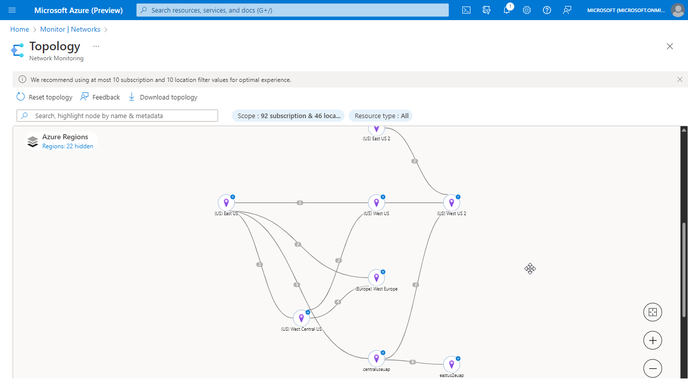

**Network health and metrics:**\
The Azure Monitor Network Insights Overview page provides an easy way to visualize the inventory networking resources, together with resource health and alerts. It's divided into four key functional areas: 

- Search and filtering: Customize the resource health and alerts view by using filters like Subscription, Resource Group, and Type.
- Resource health and metrics: Each tile on the page displays the number of instances of that resource type deployed across all selected subscriptions. It also displays the health status of the resource. Selecting any item in the grid view brings up Health column to get resource health for that connection
- Alerts: The Alert box on the right side of the page provides a view of all alerts generated for the selected resources across all subscriptions.
- Resource view: The Resource view helps you visualize how a resource is configured. The Resource view is currently available for Azure Application Gateway, Azure Virtual WAN, and Azure Load Balancer.

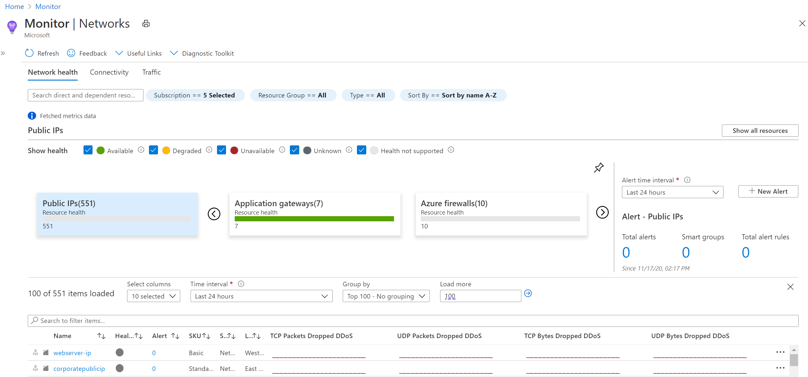

**Connectivity:**\
The Connectivity tab provides an easy way to visualize all tests configured via Connection Monitor for the selected set of subscriptions. Reachable settings provide easy access to configurations for your reachability criteria, based on checks failed (%) and RTT (ms).
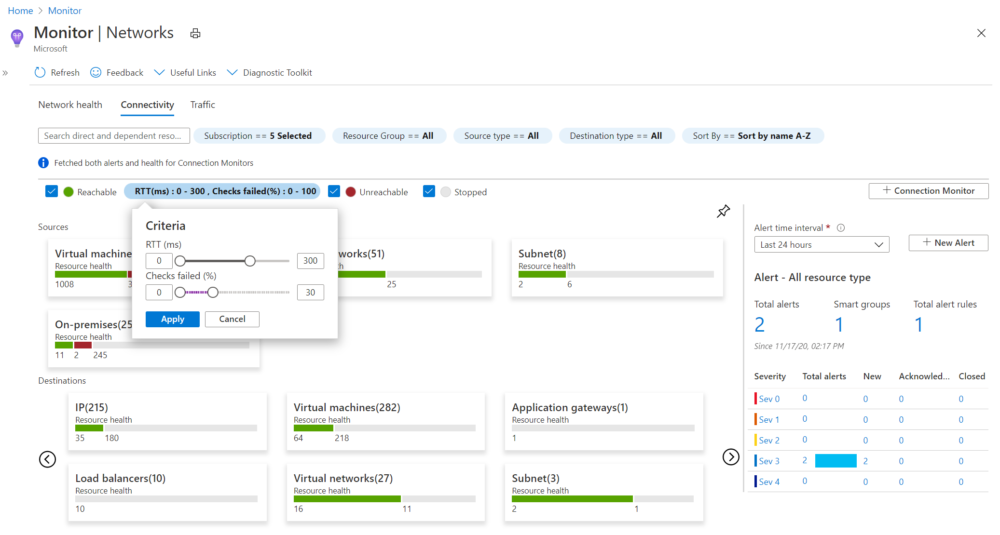

**Traffic:**\
The Traffic tab provides access to all NSGs configured for NSG flow logs and Traffic Analytics for the selected set of subscriptions, grouped by location. Traffic Analytics provides rich analytics and visualization derived from NSG flow logs and other Azure resources' data

The tiled regional view displays all NSGs along with the NSG flow logs and Traffic Analytics configuration status. If a region tile is selected, a grid view appears that provides NSG flow logs and Traffic Analytics in a view that's easy to read and configure:
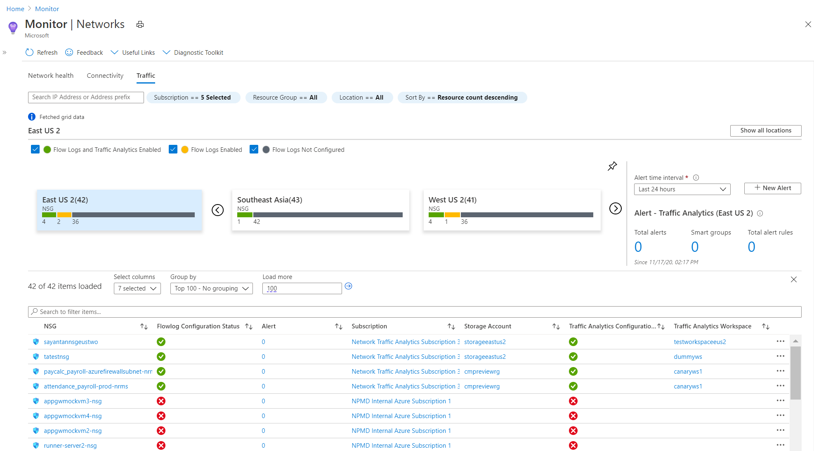

**Diagnostic Toolkit:**\
Diagnostic Toolkit provides access to all  diagnostic features available for troubleshooting an azure network. The drop-down list can be used to access features like packet capture, VPN troubleshooting, connection troubleshooting, next hop, and IP flow verify

---
### Use Azure Network Watcher  
Azure Network Watcher provides tools to monitor, diagnose, view metrics, and enable or disable logs for resources in an Azure virtual network. Network Watcher is designed to monitor and repair the network health of IaaS (Infrastructure-as-a-Service) products including Virtual Machines (VM), Virtual Networks, Application Gateways, Load balancers, etc.

**Monitor:** 

- **Connection Monitor**: Monitors communication at a regular interval and informs of reachability, latency, and network topology changes between the VM and the endpoint. For example, a web server VM that communicates with a database server. If an endpoint becomes unreachable, connection troubleshoot notifies of the reason. Potential reasons are a DNS name resolution problem, the CPU, memory, or firewall within the operating system of a VM, or the hop type of a custom route, or the security rule for the VM or subnet of the outbound connection

- **Network Performance Monitor**: A cloud-based hybrid network monitoring solution that helps monitor network performance between various points from withinin a network infrastructure. It also helps monitor network connectivity to service and application endpoints and monitor the performance of Azure ExpressRoute detecting network issues like traffic blackholing, routing errors, and issues that conventional network monitoring methods aren't able to detect.

- **Topology**: Allows generating a visual diagram of the resources in a virtual network and the relationships between the resources. 

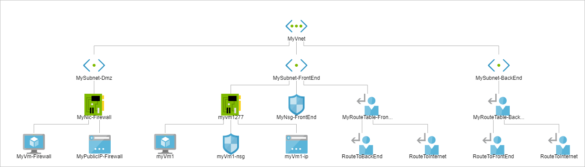

**Diagnose:**\
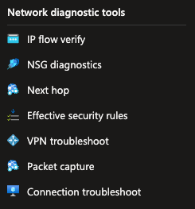

- **IP flow verify:** checks if a packet is allowed or denied to or from a virtual machine based on 5-tuple information. The security group decision and the name of the rule that denied the packet is returned.
- **Network Security Group (NSG) Diagnostics tool:** Provides detailed information to understand and debug the security configuration of your network. For a given source-destination pair, the API returns all NSGs that will be traversed, the rules that will be applied in each NSG and the final allow/deny status for the flow.
- **Next Hop:** Provides the next hop from the target virtual machine to the destination IP address.
- **VPN Troubleshoot:** Diagnoses the health of the virtual network gateway or connection. 
- **Packet Capture:** Captures can be stored in Azure Storage, on a VM's disk, or both. The capture file can then be analyze using several standard network capture analysis tools
- **Network Watcher Connection Troubleshoot**: Provides the capability to check a direct TCP connection from a virtual machine (VM) to a VM, fully qualified domain name (FQDN), URI, or IPv4 address. 

**Metrics:**\
There are limits to the number of network resources that can be created within an Azure subscription and region. The network subscription limit capability provides a summary of how many of each network resource have been deployed in a subscription and region, and what the limit is for the resource. 

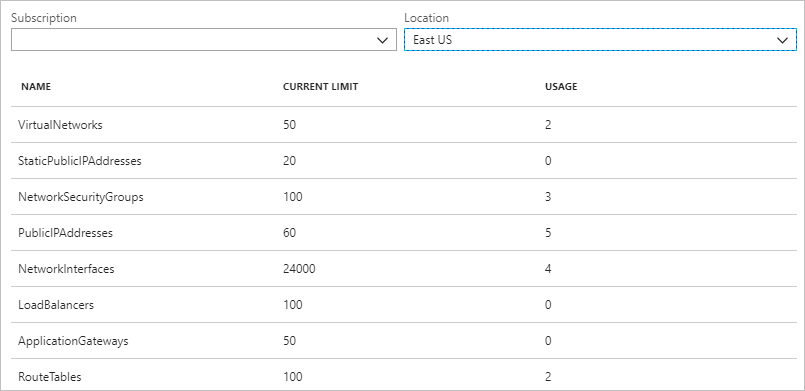

**Logs:**\

- **NSG flow logs:** allows logging the source and destination IP address, port, protocol, and whether traffic was allowed or denied by an NSG. The logs can be analyzed using a variety of tools, such as Power BI and the traffic analytics capability.

- **Diagnostic Logs:** Provides a single interface to enable and disable network resource diagnostic logs for any existing network resource that generates a diagnostic log. The diagnostic logs can be viewerd using tools such as Microsoft Power BI and Azure Monitor logs.

- **Traffic Analytics:** Provides visibility into user and application activity in cloud networks. Specifically, traffic analytics analyzes Azure Network Watcher network security group (NSG) flow logs to provide insights into traffic flow in your Azure cloud
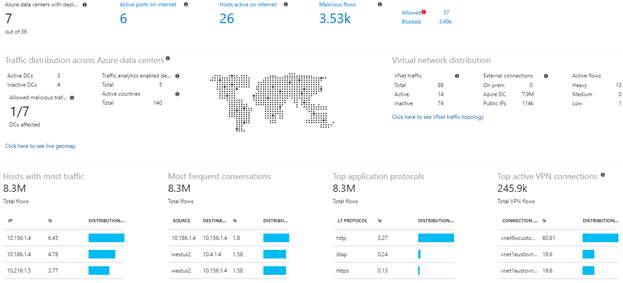

---

## Integrate an on-premises network with an Azure virtual network  
There are three options for connecting an on-premises network to an Azure Virtual Network:
- VPN connection
- Express Route
- ExpressRoute with VPN failover

### Create and configure Azure VPN Gateway   
A VPN gateway is a specific type of **virtual network gateway** that is used to send encrypted traffic between an Azure virtual network and an on-premises location over the public Internet. Each virtual network can have only one VPN gateway that allows multiple connections to the same VPN gateway. 
 
There are multiple VPN Connectivity types outlined below:

- **VNet-to-VNet VPN Connection (IPsec/IKE VPN tunnel):** Allows connecting VNets from different regions, different subscriptions and different tenats. This type of configuration creates a connection between two virtual network gateways. 
  - Both connectivity types use a VPN gateway to provide a secure tunnel using IPsec/IKE. 

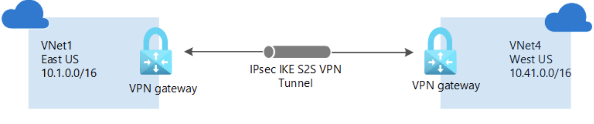

- ***Site-to-Site Connection (S2S):*** A connection type used to connect an on-premises network to an Azure virtual network over an IPsec/IKE (IKEv1 or IKEv2) VPN tunnel. This type of connection requires a VPN device located on-premises that has an externally facing public IP address assigned to it. 

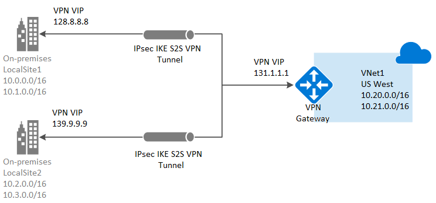

- ***Point-to-Site (P2S):*** A connection type between a single PC and Azure VPN Gateway running over the internet. Sometimes referred to as a “VPN Tunnel,” this on-demand connection is initiated by the user and secured by using a certificate. The connection uses the SSTP protocol on port 443 to provide encrypted communication over the internet between the PC and the VNet. P2S connections are useful for remote employees or those that only want to establish connectivity when they need it. 

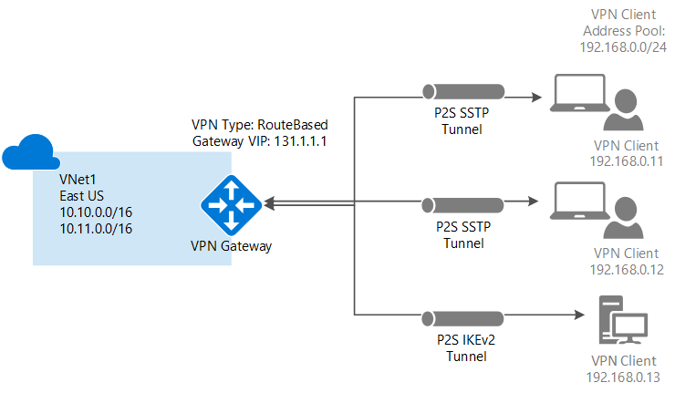

### Monitor on-premises connectivity  

### Create and configure Azure ExpressRoute  
ExpressRoute connections use a private, dedicated connection through a third-party connectivity provider. The private connection extends an on-premises network into Azure.

This architecture is suitable for hybrid applications running large-scale, mission-critical workloads that require a high degree of scalability.

### Configure Azure Virtual WAN Monitor and back up  
Azure Virtual WAN is a networking service that brings many networking, security, and routing functionalities together to provide a single operational interface. Some of the main features include:
- Branch connectivity.
- Site-to-site VPN connectivity.
- Remote user VPN connectivity (point-to-site).
- Private connectivity (ExpressRoute).
- Intra-cloud connectivity (transitive connectivity for virtual networks).
- VPN ExpressRoute inter-connectivity.
- Routing, Azure Firewall, and encryption for private connectivity.

The Virtual WAN architecture is a hub and spoke architecture with scale and performance built in for branches (VPN/SD-WAN devices), users (Azure VPN/OpenVPN/IKEv2 clients), ExpressRoute circuits, and virtual networks. It enables a global transit network architecture, where the cloud hosted network 'hub' enables transitive connectivity between endpoints that may be distributed across different types of 'spokes'.

