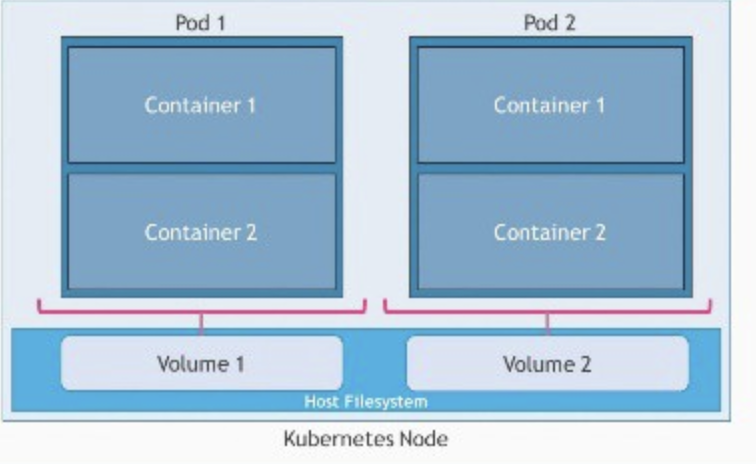
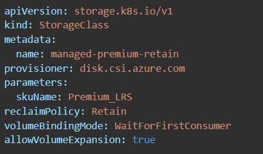
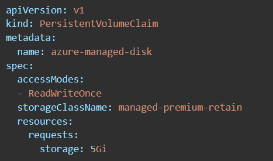

### Configure container groups for Azure Container Instances  

ACI supports scheduling of multi-container groups that share a host machine, local network, storage, and lifecycle. This enables combing the main app container with other supporting role containers, such as logging sidecars. It's similar in concept to a pod in Kubernetes.  Multi-container groups currently support only Linux containers

 

Resource Allocation:
ACI allocates resources such as CPUs, memory, and optionally GPUs to a multi-container group by adding the resource requests of the instances in the group. The folowing example will allocate two container instances, each requesting 1 CPU for a total of 2  allocated CPUs.

 

Networking:
Container groups can share an external-facing IP address, one or more ports on that IP address, and a DNS label with a FQDN. To enable external clients to reach a container within the group, the port on the IP address must be exposed. 

Deployment:
There are two common ways to deploy a multi-container group: use a Resource Manager template or a YAML file.  

A Resource Manager template is recommended when you need to deploy additional Azure service resources (for example, an Azure Files share) when you deploy the container instances.  
- DeployAndManageAzureComputeResources\ContainerInstance\ContainerGroup\containergroup.json
 
Due to the YAML format's more concise nature, a YAML file is recommended when deployment includes only container instances. There is also an option to do a Docker Compose file
- DeployAndManageAzureComputeResources\ContainerInstance\ContainerGroup\containergroup.yaml

Storage
You can specify external volumes to mount within a container group.

&nbsp;
### Configure storage for Azure Kubernetes Service (AKS)  
Applications running in AKS may need to store and retrieve data from storage that persists on data volumes within the Azure platform. Furthermore, multiple pods may need to share these same data volumes and reattach data volumes if the pod is killed and rescheduled on a different node.

#### Volume Types:
The following are ways to provide storage to an AKS cluster:

 - **Volumes:** Let pods write to a filesystem that exists as long as the pod exists. It is defined in the context of the pod. They also allow sharing data between containers in the same pod but data in that volume will be destroyed when the pod is restarted. Volume decouples the storage from the Container. **Its lifecycle is coupled to a pod**. Data volumes can use: Azure Disks, Azure Files, Azure NetApp Files, or Azure Blobs.
 

- **Persistent Volumes:** Serves as a long-term storage in the cluster. They exist beyond containers, pods, and nodes. A pod uses a persistent volume claim to to get read and write access to the persistent volume. PersistentVolume decouples the storage from the Pod. **Its lifecycle is independent**. It enables safe pod restarts and sharing data between pods. Persistent Volume use Azure Disks or Files to provide the PersistentVolume depending the need for concurrent access to the data 
  - managed by the Kubernetes API
 

#### Creating a Persistent Volumne in AKS
In order to create a persistent volume in AKS, you must be familiar with the following two concepts

- **Storage classes:** The StorageClass defines the type of storage and the reclaimPolicy. When you delete the pod and the persistent volume is no longer required, the reclaimPolicy controls the behavior of the underlying Azure storage resource. The underlying storage resource can either be deleted or kept for use with a future pod.

The following example uses Premium Managed Disks and specifies that the underlying Azure Disk should be retained when you delete the pod:
 

- **Persistent volume claims:** A persistent volume (PV) is the "physical" volume on the host machine that stores your persistent data. A persistent volume claim (PVC) is a request for the platform to create a PV for you, and you attach PVs to your pods via a PVC.

 

The Azure Disks Container Storage Interface (CSI) driver is a CSI specification-compliant driver used by Azure Kubernetes Service (AKS) to manage the lifecycle of Azure Disks.

The CSI is a standard for exposing arbitrary block and file storage systems to containerized workloads on Kubernetes. By adopting and using CSI, AKS now can write, deploy, and iterate plug-ins to expose new or improve existing storage systems in Kubernetes. Using CSI drivers in AKS avoids having to touch the core Kubernetes code and wait for its release cycles.

Since Azure Disks are mounted as ReadWriteOnce, they're only available to a single pod. For storage volumes that can be accessed by multiple pods simultaneously, use Azure File
 
&nbsp;
### Configure scaling for AKS  
When running applications in AKS, you may need to increase or decrease the amount of compute resources. As the number of application instances you need change, the number of underlying Kubernetes nodes may also need to change. You also might need to quickly provision a large number of additional application instances.
 
Manually scale:

Horizontal pod autoscaler (HPA):

Cluster autoscaler"

Azure Container Instance (ACI) integration with AKS

&nbsp;
### Configure network connections for AKS  
&nbsp;
### Upgrade an AKS cluster  

 ---

## Create and configure Azure App Service  

### create an App Service plan  
&nbsp;
### configure scaling settings in an App Service plan  
&nbsp;
### create an App Service 
&nbsp;
### secure an App Service  
&nbsp;
### configure custom domain names 
&nbsp;
### configure backup for an App Service  
&nbsp;
### configure networking settings 
&nbsp;

### configure deployment settings  
&nbsp;