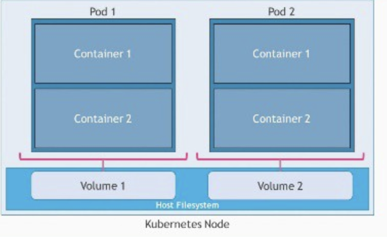
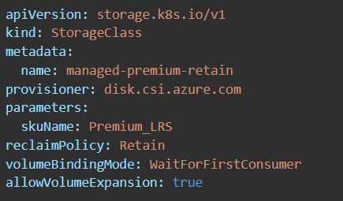
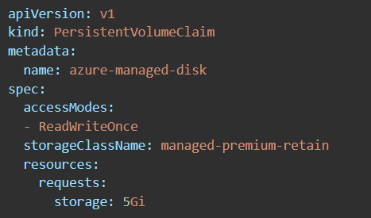
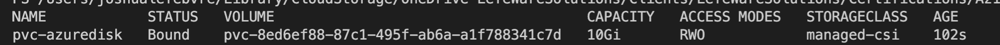
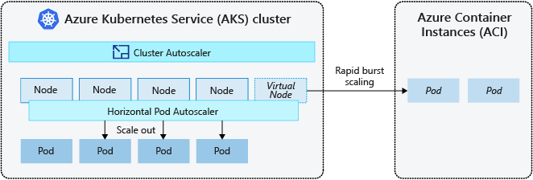

### Configure container groups for Azure Container Instances  

ACI supports scheduling of multi-container groups that share a host machine, local network, storage, and lifecycle. This enables combing the main app container with other supporting role containers, such as logging sidecars. It's similar in concept to a pod in Kubernetes.  Multi-container groups currently support only Linux containers

 

Resource Allocation:
ACI allocates resources such as CPUs, memory, and optionally GPUs to a multi-container group by adding the resource requests of the instances in the group. The folowing example will allocate two container instances, each requesting 1 CPU for a total of 2  allocated CPUs.

 

Networking:
Container groups can share an external-facing IP address, one or more ports on that IP address, and a DNS label with a FQDN. To enable external clients to reach a container within the group, the port on the IP address must be exposed. 

Deployment:
There are two common ways to deploy a multi-container group: use a Resource Manager template or a YAML file.  

A Resource Manager template is recommended when you need to deploy additional Azure service resources (for example, an Azure Files share) when you deploy the container instances.  
- DeployAndManageAzureComputeResources\ContainerInstance\ContainerGroup\containergroup.json
 
Due to the YAML format's more concise nature, a YAML file is recommended when deployment includes only container instances. There is also an option to do a Docker Compose file
- DeployAndManageAzureComputeResources\ContainerInstance\ContainerGroup\containergroup.yaml

Storage
You can specify external volumes to mount within a container group.

&nbsp;
### Configure storage for Azure Kubernetes Service (AKS)  
Applications running in AKS may need to store and retrieve data from storage that persists on data volumes within the Azure platform. Furthermore, multiple pods may need to share these same data volumes and reattach data volumes if the pod is killed and rescheduled on a different node.

#### Volume Types:
The following are ways to provide storage to an AKS cluster:

 - **Volumes:** Let pods write to a filesystem that exists as long as the pod exists. It is defined in the context of the pod. They also allow sharing data between containers in the same pod but data in that volume will be destroyed when the pod is restarted. Volume decouples the storage from the Container. **Its lifecycle is coupled to a pod**. Data volumes can use: Azure Disks, Azure Files, Azure NetApp Files, or Azure Blobs.

 

- **Persistent Volumes:** Serves as a long-term storage in the cluster. They exist beyond containers, pods, and nodes. A pod uses a persistent volume claim to to get read and write access to the persistent volume. PersistentVolume decouples the storage from the Pod. **Its lifecycle is independent**. It enables safe pod restarts and sharing data between pods. Persistent Volume use Azure Disks or Files to provide the PersistentVolume depending the need for concurrent access to the data 
  - managed by the Kubernetes API
 

#### Creating a Persistent Volumne in AKS
In order to create a persistent volume in AKS, you must be familiar with the following two concepts

Storage classes: 
The StorageClass defines the type of storage and the reclaimPolicy. When a pod is deleted and the persistent volume is no longer required, the reclaimPolicy controls the behavior of the underlying Azure storage resource. The underlying storage resource can either be deleted or kept for use with a future pod.

The following is an example of a custom storageClass that uses Premium Managed Disks and specifies that the underlying Azure Disk should be retained when you delete the pod:
 

 There are also a number of default storage classes to use:
 - managed-csi:	Uses Azure StandardSSD locally redundant storage (LRS) to create a Managed Disk. The reclaim policy ensures that the underlying Azure Disk is deleted when the persistent volume that used it is deleted. 
 - managed-csi-premium	Uses Azure Premium locally redundant storage (LRS) to create a Managed Disk. The reclaim: policy again ensures that the underlying Azure Disk is deleted when the persistent volume that used it is deleted. 
- azurefile-csi:	Uses Azure Standard storage to create an Azure File Share. The reclaim policy ensures that the underlying Azure File Share is deleted when the persistent volume that used it is deleted.
- azurefile-csi-premium:	Uses Azure Premium storage to create an Azure File Share. The reclaim policy ensures that the underlying Azure File Share is deleted when the persistent volume that used it is deleted.

**Persistent volume claims:** While a persistent volume is the "physical" volume on the host machine that stores the persistent data, a persistent volume claim (PVC) is a request for the platform to create a PV, as well as attach PVs to your pods via a PVC. The Kubernetes API server can dynamically provision the underlying Azure storage resource if no existing resource can fulfill the claim based on the defined StorageClass.

 

 

Since Azure Disks are mounted as ReadWriteOnce, they're only available to a single pod. For storage volumes that can be accessed by multiple pods simultaneously, use Azure File
 
&nbsp;
### Configure scaling for AKS  
When running applications in AKS, increasing or decreasing the amount of compute resources may be required. As the number of application instances you need change, the number of underlying Kubernetes nodes may also need to change. You also might need to quickly provision a large number of additional application instances.
 
- Manually scale: To manually scale, define the replica or node count and the Kubernetes API then schedules creating additional pods or draining nodes based on that replica or node count

- Horizontal pod autoscaler (HPA):
Kubernetes uses the horizontal pod autoscaler (HPA) to monitor the resource demand and automatically scale the number of replicas. When changes are required, the number of replicas is increased or decreased accordingly. When configuring HPA for a given deployment, it is possible to define the minimum and maximum number of replicas that can run as well as the metric to monitor and base any scaling decisions on, such as CPU usage.

- Cluster autoscaler: The cluster autoscaler adjusts the number of nodes based on the requested compute resources in the node pool. By default, the cluster autoscaler checks the Metrics API server and if the cluster autoscale determines that a change is required, the number of nodes in the AKS cluster is increased or decreased accordingly.

- Azure Container Instance (ACI) integration with AKS: When the cluster autoscaler needs tp deploy additional nodes in the node pool, it may take a few minutes for those nodes to successfully provision. This means that additional pods would need to wait to be sceduled. AKS can be integrated with ACI for scheduling pods radidly without additional infrastructure overhead on what are known as "virtual nodes".

 
&nbsp;

### Configure network connections for AKS  

#### Kubenet (Basic Networking):
By default, AKS uses "kubenet" where an Azure vnet and subnet are automatically created. With kubenet, only nodes get an IP address from the Azure vnet subnet. Pods receive an IP address from a logically different address space to the Azure vnet subnet of the nodes. Network address translation (NAT) is then configured so that the pods can reach resources on the Azure vnet. The source IP address of the traffic is NAT'd to the node's primary IP address. This approach greatly reduces the number of IP addresses needed to reserve in the network space for pods to use.

#### Container Networking Interface (Advanced Networking):
With Azure CNI, every pod gets an IP address from the subnet and can be accessed directly. These IP addresses must be unique across your network space, and must be planned in advance. Each node has a configuration parameter for the maximum number of pods that it supports. The equivalent number of IP addresses per node are then reserved up front for that node. **This approach requires more planning, and often leads to IP address exhaustion or the need to rebuild clusters in a larger subnet as your application demands grow.** You can configure the maximum pods deployable to a node at cluster create time or when creating new node pools. If you don't specify maxPods when creating new node pools, you receive a default value of 110 for kubenet.
&nbsp;

### Upgrade an AKS cluster  
Part of the AKS cluster lifecycle involves performing periodic upgrades to the latest Kubernetes version. It’s important to apply the latest security releases, or upgrade to get the latest features. 

By default, AKS configures upgrades to surge with one extra node. A default value of one for the max surge settings will enable AKS to minimize workload disruption by creating an extra node before the cordon/drain of existing applications to replace an older versioned node. For example, a max surge value of 100% provides the fastest possible upgrade process (doubling the node count) but also causes all nodes in the node pool to be drained simultaneously. You may wish to use a higher value such as this for testing environments. For production node pools,a max_surge setting of 33% is recommeneded.

See DeployAndManageAzureComputeResources/AKS/CreateAKSCluster.ps1

 ---

## Create and configure Azure App Service  
Azure App Service enables you to build and host web apps, mobile back ends, and RESTful APIs in the programming language of your choice without managing infrastructure.

### Create an App Service plan  
See DeployAndManageAzureComputeResources\AppService\CreateWebApp.ps1
&nbsp;
### Configure scaling settings in an App Service plan  
There are two workflows for scaling, scale up and scale out
- Scale up: Get more CPU, memory, disk space, and extra features like dedicated VMs, custom domains and certificates, staging slots, autoscaling etc. Scale up by changing the pricing tier of the App Service plan that the app belongs to.
- Scale out: Increase the number of VM instances that run the app. Scale out to as many as 30 instances, depending on pricing tier. App Service Environments in Isolated tier further increases scale-out count to 100 instances. 

The scale settings take only seconds to apply and affect all apps in the App Service plan and don't require changing code or redeploying applications.
&nbsp;
### Create an App Service 
See DeployAndManageAzureComputeResources\AppService\CreateWebApp.ps1
&nbsp;

### Secure an App Service  

&nbsp;

### Configure custom domain names 
Confirming ownership:
1. Navigate to the App Service in the portal
2. In the left pane of your app page, select Custom domains
3. Copy the ID in the Custom Domain Verification ID box in the Custom Domains page for the next step.
 
4. Create the following DNS records by signing into your domain record
   - CNAME: <app-name>.azurewebsites.net
   - TXT: asuid.subdomain - used to vertify ownerish of custom domain
    

Allow custom mapping:
1. Under the Custom Domains section select add Custom Domain

2. Type the fqdn, i.e. www.contoso.com
3. Select Validate 
4. The Add custom domain page appears to set to CNAME (www.example.com or any subdomain). 
5. Select Add custom domain.

6. The app should show a custom domain 

&nbsp;

### Configure backup for an App Service  
In Azure App Service it is possible to make on-demand custom backups or configure scheduled custom backups. You can restore a backup by overwriting an existing app by restoring to a new app or slot. There are two types of backups in App Service, Automatic backups and Custom backups (On-demand backups are retained indefinitely). Available for Standard and Premium tier

Create a custom backup
1. From App Service left menu, select Backups.
2. At the top of the Backups page, select Configure custom backups.
3. In Storage account, select an existing storage account or select Create new. Do the same with Container.

4. Click Configure.
5.At the top of the Backups page, select Backup Now.
&nbsp;
### Configure networking settings 
By default, apps hosted in App Service are accessible directly through the internet and can reach only internet-hosted endpoints. But for many applications, control is needed for the inbound and outbound network traffic.

Inbound features:
- App-assigned address:
- Access restrictions:
- Service endpoints
- Private endpoints

Outbound features:
- Hybrid Connections
- Gateway-required virtual network integration
- Virtual network integration

&nbsp;

### Configure deployment settings  

&nbsp;