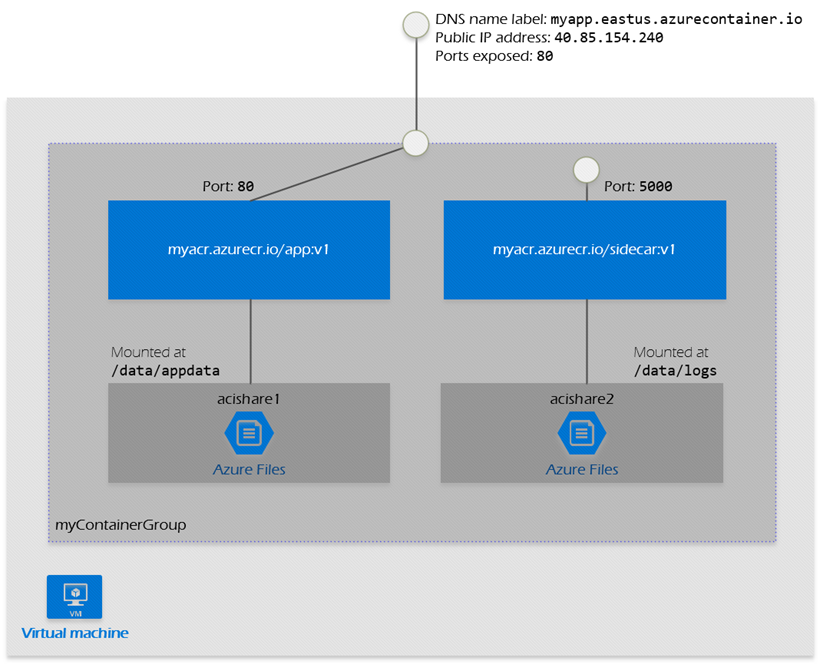
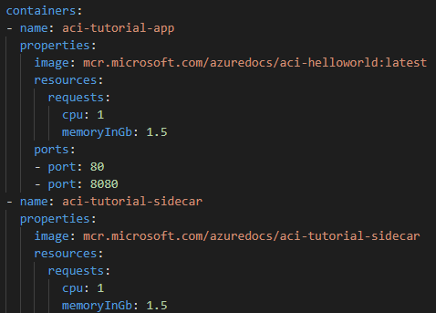

### Configure container groups for Azure Container Instances  

ACI supports scheduling of multi-container groups that share a host machine, local network, storage, and lifecycle. This enables combing the main app container with other supporting role containers, such as logging sidecars. It's similar in concept to a pod in Kubernetes.  Multi-container groups currently support only Linux containers

 

Resource Allocation:
ACI allocates resources such as CPUs, memory, and optionally GPUs to a multi-container group by adding the resource requests of the instances in the group. The folowing example will allocate two container instances, each requesting 1 CPU for a total of 2  allocated CPUs.

 

Networking:
Container groups can share an external-facing IP address, one or more ports on that IP address, and a DNS label with a FQDN. To enable external clients to reach a container within the group, the port on the IP address must be exposed. 

Deployment:
There are two common ways to deploy a multi-container group: use a Resource Manager template or a YAML file.  

A Resource Manager template is recommended when you need to deploy additional Azure service resources (for example, an Azure Files share) when you deploy the container instances.  
- DeployAndManageAzureComputeResources\ContainerInstance\ContainerGroup\containergroup.json
 
Due to the YAML format's more concise nature, a YAML file is recommended when deployment includes only container instances. There is also an option to do a Docker Compose file
- DeployAndManageAzureComputeResources\ContainerInstance\ContainerGroup\containergroup.yaml

Storage
You can specify external volumes to mount within a container group.

### Configure storage for Azure Kubernetes Service (AKS)  
AKS simplifies deploying a managed Kubernetes cluster in Azure by offloading the operational overhead to Azure. As a hosted Kubernetes service, Azure handles critical tasks, like health monitoring and maintenance. Since Kubernetes masters are managed by Azure, you only manage and maintain the agent nodes. Thus, AKS is free; you only pay for the agent nodes within your clusters, not for the masters.
 

### Configure scaling for AKS  

 

### Configure network connections for AKS  

### Upgrade an AKS cluster  

 ---

## Create and configure Azure App Service  

### create an App Service plan  

### configure scaling settings in an App Service plan  

### create an App Service 

### secure an App Service  

### configure custom domain names 

### configure backup for an App Service  

### configure networking settings 

### configure deployment settings  